# python是一种怎样的语言
* python是一门跨平台、开源、免费的解释型**高级动态编程语言**，支持伪编译将python源程序转换为**字节码**来优化程序和提高运行速度，支持使用py2exe、pyinstaller或cx_Freeze工具将python程序**转换为二进制可执行文件**。
* python支持**命令式编程、函数式编程**，完全支持**面向对象程序设计**，语法简介清晰，拥有大量的几乎支持所有领域应用开发的成熟**扩展库**。
* **胶水语言**：可以把多种不同语言编写的程序融合到一起实现无缝拼接，更好地发挥不同语言和工具的优势，满足不同应用领域的需求。
## 使用pip管理第三方包
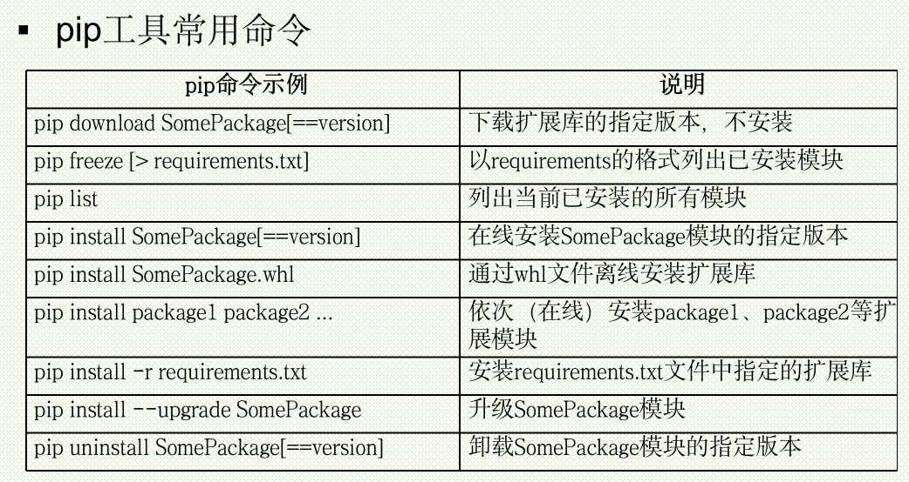
## python的对象模型
对象是python语言中最基本的概念，在python中处理的一切都是对象。python中有许多内置对象可供编程者使用。
* 内置对象可直接使用，如数字、字符串、列表、del等；
* 非内置对象需要倒入模块才能使用，如正弦函数sin(x),随机数产生函数random()等。
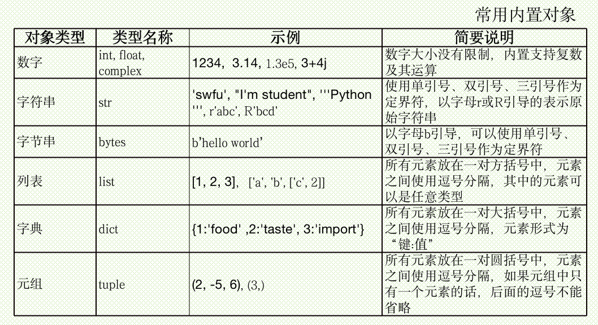
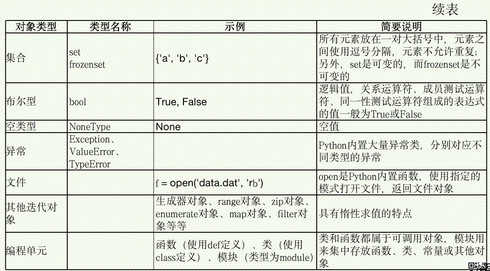
## python变量
### 变量创建
在python中，不需要实现声明变量名及其类型，直接赋值即可创建各种类型的对象变量。这一点适用于python任意类型的对象。
例如语句
> x=3

创建了整型变量x，并赋值为3。
再例如语句
> x = 'hello world'

创建了字符串变量x,并赋值为‘hello world’。

### 语言特点
* python 属于**强类型编程语言**，python解释器会根据赋值或运算来自动推断变量类型。
* python还是一种**动态类型语言**，变量的类型也是可以随时变化的。

```
>>> x =3
>>> print(type(x))
<class 'int'>
>>> x = 'hello world'
>>> print(type(x))  #查看变量类型
<class 'str'>
>>> x = [1,2,3]
>>> print(type(x))
<class 'list'>
>>> isinstance(3,int)  #测试对象是否是某个类型的实例
True
>>> isinstance('hello world',str)
True
```
### 赋值运算
如果变量出现在赋值运算符或符合赋值运算符（例如+=、*=等）的左边则表示创建变量或修改变量的值，否则表示引用该变量的值，这一点同样适用于使用下标来访问列表、字典等**可变序列**以及其他自定义对象中元素的情况。

```javascript {.line-numbers}
>>> x = 3 #创建整型变量
>>> print(x**2)
9
>>> x += 6 #修改变量值
>>> print(x) #读取变量值并输出显示
9
>>> x = [1,2,3] #创建列表对象
>>> x[1]=5 #修改列表元素
>>>print[x] #输出显示整个列表
[1,5,3]
>>> print(x[2]) #输出显示列表指定元素
3
```
字符串和元组属于**不可变序列**，不能通过下标的方式来修改其中的元素值，试图修改元组中元素的值时会抛出异常。
``` javascript {.line-numbers}
>>> x = (1,2,3)
>>> print(x)
(1, 2, 3)

>>> x[1] = 5
Traceback (most recent call last):
  File "<pyshell#7>", line 1, in <module>
    x[1] = 5
TypeError: 'tuple' object does not support item assignment

```
### 变量内存管理
python采用的是基于值的内存管理方式，如果为不同变量赋值相同值，这个值在内存中只有一份，多个变量指向同一块内存地址。

```
>>> x = 3
>>> id(x)
10417624
>>> y = 3
>>> id(y)
10417624
>>> x = [1, 1, 1, 1]
>>> id(x[0]) == id(x[1])
True
```
python具有**自动内存管理功能**，对于没有任何变量指向的值，python自动将其删除。python会跟踪所有的值。因此，python程序员一般情况下不需要太多考虑内存管理的问题。
尽管如此，显式使用del命令删除不需要的值或显式关闭不再需要访问的资源，仍是一个好习惯，同时也是一个优秀程序员的基本素养之一。
### 变量命名规范
在定义变量名的时候，需要注意以下问题：
* 变量名**必须**以字母或下划线开头，但以下划线开头的变量在Python中有特殊含义；
* 变量名中**不能**有空格以及标点符号（括号、引号、逗号、斜线、反斜线、冒号、句号、问号等等）；
* **不能**使用关键字作变量名，可以导入keyword模块后使用print(keyword.kwlist)查看所有Python关键字；
* **不建议**使用系统内置的模块名、类型名或函数名以及已导入的模块名及其成员名作变量名，这将会改变其类型和含义，可以通过dir(__builtins__)查看所有内置模块、类型和函数；
* 变量名对英文字母的大小写敏感，例如student和Student是不同的变量。

### 数字变量

数字是**不可变对象**，可以表示任意大小的数字。

```
>>> a=99999999999999999999999999999999
>>> a*a
9999999999999999999999999999999800000000000000000000000000000001
>>> a**3
999999999999999999999999999999970000000000000000000000000000000299999999999999999999999999999999
```

python的IDEL交互界面可以当作渐变计算器来使用
```
>>> ((3**2) + (4**2)) ** 0.5
5.0
```
#### 整数类型
* 十进制整数，如0、-1、9、123
* 十六进制证书，需要16个数字0、1、2、3、4、5、6、7、8、9、a、b、c、d、e、f来表示整数，必须以0x开头，如0x10、0xfa、0xabcdef
* 八进制证书，只需要8个数字0、1、2、3、4、5、6、7来表示整数，必须以0o开头，如0o35、0o11
* 二进制证书，只需要2个数字0、1来表示整数，必须以0b开头，如0b101，0b100
#### 浮点数
浮点数又称小数，如：15.0、0.37、-11.2、1.2e2、314.15e-2
#### 复数
Python内置支持复数类型。

``` javascript{.line-numbers}
>>> a = 3+4j
>>> b = 5+6j
>>> c = a+b
>>> c
(8+10j)
>>> c.real        #查看复数实部
8.0
>>> c.imag        #查看复数虚部
10.0
>>> a.conjugate() #返回共轭复数
(3-4j)
>>> a*b           #复数乘法
(-9+38j)
>>> a/b           #复数除法
(0.6393442622950819+0.03278688524590165j)
```
### 字符串
* 用单引号、双引号或三引号括起来的符号系列称为字符串
* 单引号、双引号、三单引号、三双引号可以互相嵌套，用来表示复杂字符串
'abc'、'123'、'中国'、"Python"、'''Tom said, "Let's go"'''
* 字符串属于不可变序列
* 空串表示为''或 "" 
* 三引号'''或"""表示的字符串可以换行，支持排版较为复杂的字符串；三引号还可以在程序中表示较长的注释。

#### 字符串处理
字符串合并
> \>>> a = 'abc' + '123'     #生成新对象

#### 字符串格式化

```
>>> a = 3.6674
>>> '%7.3f' % a
'  3.667'
>>> "%d:%c"%(65,65)
'65:A'
>>> """My name is %s, and my age is %d""" % ('Dong Fuguo',39)
'My name is Dong Fuguo, and my age is 39'
```

#### 常用转义字符
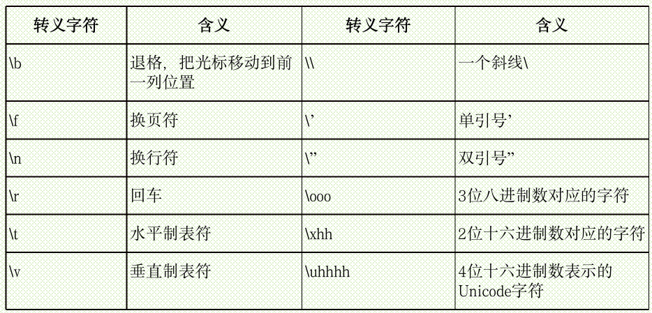

用法如下
```
>>> print('Hello\nWorld')   #包含转义字符的字符串
Hello
World
>>> print('\101')      #三位八进制数对应的字符
A
>>> print('\x41')     #两位十六进制数对应的字符
A
>>> print('我是\u8463\u4ed8\u56fd')  #四位十六进制数表示的Unicode字符
我是董付国
```
 字符串界定符前面加字母r表示原始字符串，其中的特殊字符不进行转义，但字符串的最后一个字符不能是\。原始字符串主要用于正则表达式、文件路径或者URL的场合。
```
>>> path = 'C:\Windows\notepad.exe'
>>> print(path)                     #字符\n被转义为换行符
C:\Windows
otepad.exe
>>> path = r'C:\Windows\notepad.exe'  #原始字符串，任何字符都不转义
>>> print(path)
C:\Windows\notepad.exe
```
## 运算符与表达式
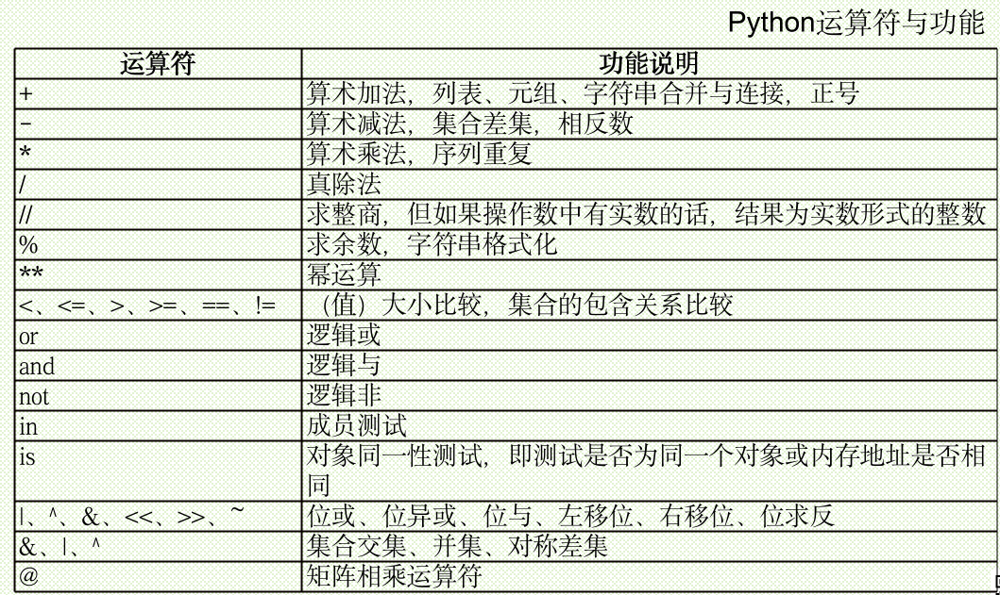

### 加法运算符（+）
+运算符除了用于算术加法以外，还可以用于列表、元组、字符串的连接，但不支持不同类型的对象之间相加或连接。
```javascript{.line-numbers}
>>> [1, 2, 3] + [4, 5, 6]          #连接两个列表
[1, 2, 3, 4, 5, 6]
>>> (1, 2, 3) + (4,)                #连接两个元组
(1, 2, 3, 4)
>>> 'abcd' + '1234'               #连接两个字符串
'abcd1234'
>>> 'A' + 1                            #不支持字符与数字相加，抛出异常
TypeError: Can't convert 'int' object to str implicitly
>>> True + 3                        #Python内部把True当作1处理
4
>>> False + 3                      #把False当作0处理
3
```
### 乘法运算符（*）
运算符不仅可以用于数值乘法，还可以用于列表、字符串、元组等类型，当列表、字符串或元组等类型变量与整数进行“*”运算时，表示对内容进行重复并返回重复后的新对象。
```javascript{.line-numbers}
>>> 2.0 * 3                     #浮点数与整数相乘
6.0
>>> (3+4j) * 2                  #复数与整数相乘
(6+8j)
>>> (3+4j) * (3-4j)             #复数与复数相乘
(25+0j)
>>> "a" * 10                    #字符串重复
'aaaaaaaaaa'
>>> [1,2,3] * 3                 #列表重复
[1, 2, 3, 1, 2, 3, 1, 2, 3]
>>> (1,2,3) * 3                 #元组重复
(1, 2, 3, 1, 2, 3, 1, 2, 3)
```
### 除法运算符(/和//)
Python中的除法有两种，“/”和“//”分别表示除法和整除运算，并且Python 2.x和Python 3.x对“/”运算符的解释也略有区别。在Python 3.5.2中运算结果如下：
```javascript{.line-numbers}
>>> 3/5
0.6
>>> 3//5
0
>>> 3.0/5
0.6
>>> 3.0//5
0.0
>>> 13//10
1
>>> -13//10
-2
```
### 取余运算符（%）
%运算符除去可以用于字符串格式化之外，还可以对整数和浮点数计算余数。但是由于浮点数的精确度影响，计算结果可能略有误差。
```javascript{.line-numbers}
>>> 3.1%2
1.1
>>> 6.3%2.1
2.0999999999999996
>>> 6%2
0
>>> 6.0%2
0.0
>>> 6.0%2.0
0.0
>>> 5.7%4.8
0.9000000000000004
```
### 关系运算符
关系运算符可以连用
```javascript{.line-numbers}
>>> 1 < 3 < 5       #等价于1 < 3 and 3 < 5
True
>>> 'Hello' > 'world'    #比较字符串大小
False
>>> [1, 2, 3] < [1, 2, 4]    #比较列表大小
True
>>> 'Hello' > 3     #字符串和数字不能比较
TypeError: unorderable types: str() > int()
>>> {1, 2, 3} < {1, 2, 3, 4}       #测试是否子集
```
### 成员测试运算符（in）
成员测试运算符in用于成员测试，即测试一个对象是否为另一个对象的元素。
```javascript{.line-numbers}
>>> 3 in [1, 2, 3]                      #测试3是否存在于列表[1, 2, 3]中
True
>>> 5 in range(1, 10, 1)          #range()是用来生成指定范围数字的内置函数
True
>>> 'abc' in 'abcdefg'              #子字符串测试
True
>>> for i in (3, 5, 7):                #循环，成员遍历
	print(i, end='\t')
3	5	7	
```
### 同一性测试运算符（is）
同一性测试运算符（identity comparison）is用来测试两个对象是否是同一个，如果是则返回True，否则返回False。**如果两个对象是同一个，二者具有相同的内存地址。**
```javascript{.line-numbers}
>>> 3 is 3
True
>>> x = [300, 300, 300]
>>> x[0] is x[1]                #基于值的内存管理，同一个值在内存中只有一份
True
>>> x = [1, 2, 3]
>>> y = [1, 2, 3]
>>> x is y                        #上面形式创建的x和y不是同一个列表对象
False
```
### 位运算符（<< & | ^）

位运算符**只能用于整数**，其内部执行过程为：首先将整数转换为二进制数，然后右对齐，必要的时候左侧补0，按位进行运算，最后再把计算结果转换为十进制数字返回。

```javascript{.line-numbers}
>>> 3 << 2                   #把3左移2位
12
>>> 3 & 7                    #位与运算
3
>>> 3 | 8                     #位或运算
11
>>> 3 ^ 5                    #位异或运算
6
```

集合的交集、并集、对称差集等运算借助于位运算符来实现，而差集则使用减号运算符实现（注意，并集运算符不是加号）。

```javascript{.line-numbers}
>>> {1, 2, 3} | {3, 4, 5}           #并集，自动去除重复元素
{1, 2, 3, 4, 5}
>>> {1, 2, 3} & {3, 4, 5}         #交集
{3}
>>> {1, 2, 3} ^ {3, 4, 5}          #对称差集
{1, 2, 4, 5}
>>> {1, 2, 3} - {3, 4, 5}          #差集
{1, 2}
```

### 逻辑运算符（and or）
逻辑运算符and和or具有**惰性求值**特点。

```javascript{.line-numbers}
>>> 3>5 and a>3              #注意，此时并没有定义变量a
False
>>> 3>5 or a>3                #3>5的值为False，所以需要计算后面表达式
NameError: name 'a' is not defined
>>> 3<5 or a>3                #3<5的值为True，不需要计算后面表达式
True
>>> 3 and 5                     #最后一个计算的表达式的值作为整个表达式的值
5
>>> 3 and 5>2
True
>>> 3 not in [1, 2, 3]         #逻辑非运算not
False
>>> 3 is not 5   #not的计算结果只能是True或False之一
True
```

### 矩阵相乘运算符（@）
Python 3.5增加了一个新的矩阵相乘运算符@

```javascript{.line-numbers}
>>> import numpy             #numpy是用于科学计算的Python扩展库
>>> x = numpy.ones(3)     #ones()函数用于生成全1矩阵
>>> m = numpy.eye(3)*3  #eye()函数用于生成单位矩阵
>>> m[0,2] = 5                  #设置矩阵指定位置上元素的值
>>> m[2, 0] =3
>>> x @ m                       #矩阵相乘
array([ 6.,  3.,  8.])
```

逗号并不是运算符，只是一个普通分隔符。
```javascript{.line-numbers}
>>> 'a' in 'b', 'a'
(False, 'a')
>>> 'a' in ('b', 'a')
True
>>> x = 3, 5
>>> x
(3, 5)
>>> 3 == 3, 5
(True, 5)
>>> x = 3+5, 7
>>> x
(8, 7)
```
在Python中，单个任何类型的对象或常数属于合法表达式，使用运算符连接的变量和常量以及函数调用的任意组合也属于合法的表达式。

```javascript{.line-numbers}
>>> a = [1,2,3]
>>> b = [4,5,6]
>>> c = a + b
>>> c
[1, 2, 3, 4, 5, 6]
>>> d = list(map(str, c))
>>> d
['1', '2', '3', '4', '5', '6']
>>> import math
>>> list(map(math.sin, c))
[0.8414709848078965, 0.9092974268256817, 0.1411200080598672, -0.7568024953079282, -0.9589242746631385, -0.27941549819892586]
>>> 'Hello' + ' ' + 'world'
'Hello world'
>>> 'welcome ' * 3
'welcome welcome welcome '
>>> ('welcome,'*3).rstrip(',')+'!'
'welcome,welcome,welcome!'
```

## 常用内置函数
* 内置函数不需要导入任何模块即可使用
* 执行下面的命令可以列出所有内置函数
> \>>> dir(\_\_builtins\_\_)

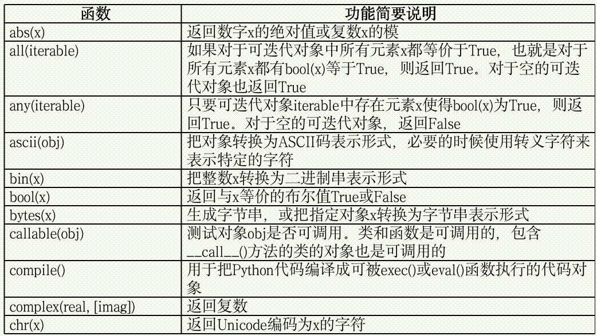
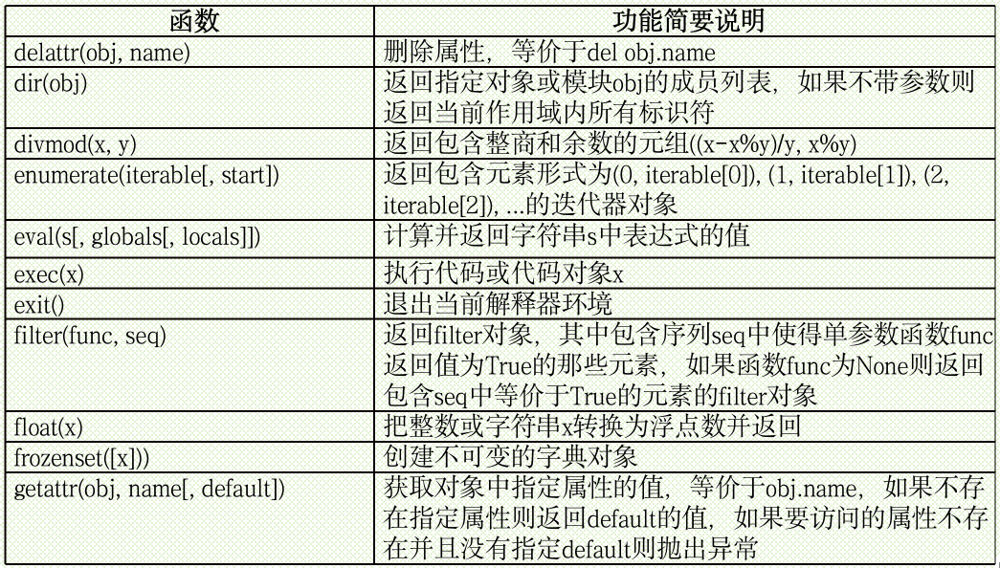
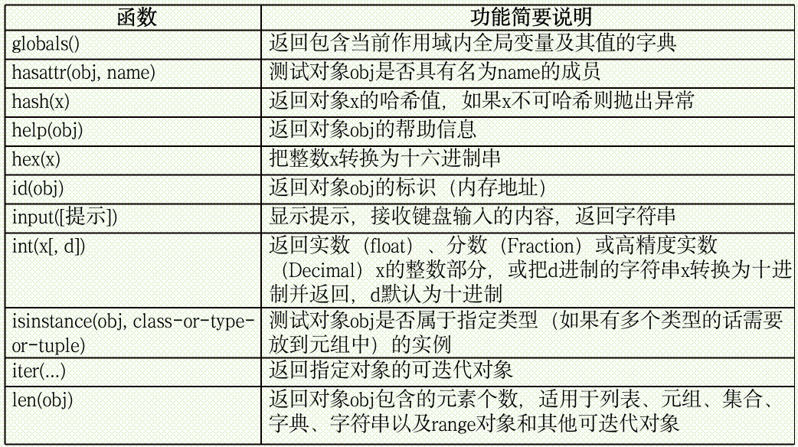
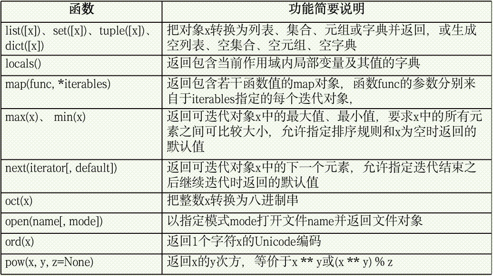
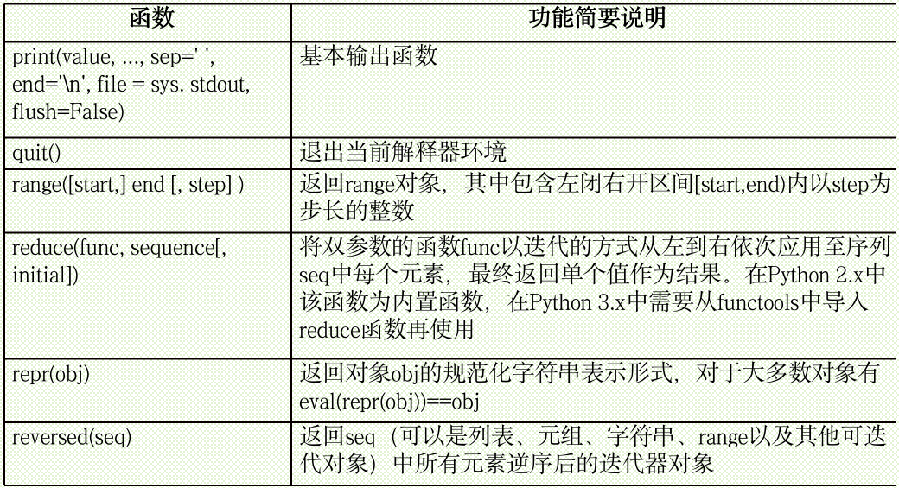
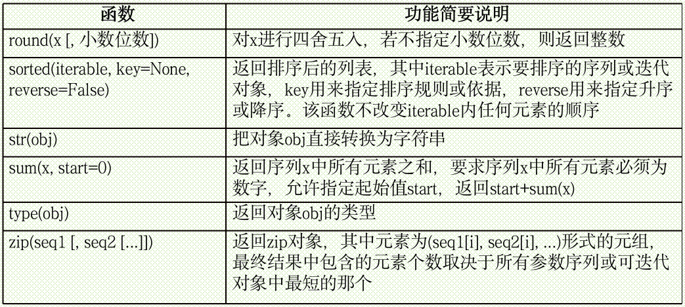

## 对象的删除
* 在Python中具有**自动内存管理功能**，Python解释器会跟踪所有的值，一旦发现某个值不再有任何变量指向，将会自动删除该值。尽管如此，自动内存管理或者垃圾回收机制并不能保证及时释放内存。显式释放自己申请的资源是程序员的好习惯之一，也是程序员素养的重要体现之一。
* 在Python中，可以使用del命令来显式删除对象并解除与值之间的指向关系。删除对象时，如果其指向的值还有别的变量指向则不删除该值，如果删除对象后该值不再有其他变量指向，则删除该值。

```javascript{.line-numbers}
>>> x = [1,2,3,4,5,6]
>>> y = 3
>>> z = y
>>> print(y)
3
>>> del y #删除对象
>>> print(y)
NameError: name 'y' is not defined
>>> print(z)
3
>>> del z
>>> print(z)
NameError: name 'z' is not defined
>>> del x[1] #删除列表中指定元素
>>> print(x)
[1, 3, 4, 5, 6]
>>> del x #删除整个列表
>>> print(x)
NameError: name 'x' is not defined
```

del命令无法删除元组或字符串中的元素，只可以删除整个元组或字符串，因为这两者均属于不可变序列。

```javascript{.line-numbers}
>>> x = (1,2,3)
>>> del x[1]
Traceback (most recent call last):
  File "<pyshell#62>", line 1, in <module>
    del x[1]
TypeError: 'tuple' object doesn't support item deletion
>>> del x
>>> print(x)
Traceback (most recent call last):
  File "<pyshell#64>", line 1, in <module>
    print(x)
NameError: name 'x' is not defined
```

## 基本输入输出
用Python进行程序设计，输入是通过input( )函数来实现的，imput( )的一般格式为：

> x = input('提示：')

该函数返回输入的对象。可输入数字、字符串和其它任意类型对象。

在Python 3.x中，不存在raw_input()函数，只提供了input()函数用来接收用户的键盘输入。在Python 3.x中，不论用户输入数据时使用什么界定符，input()函数的返回结果都是字符串，需要将其转换为相应的类型再处理。例如下面的Python 3.5.2代码：

```javascript{.line-numbers}
>>> x = input('Please input:')
Please input:3
>>> print(type(x))
<class 'str'>
>>> x = input('Please input:')
Please input:'1'
>>> print(type(x))
<class 'str'>
>>> x = input('Please input:')
Please input:[1,2,3]
>>> print(type(x))
<class 'str'>
>>> x = raw_input('Please input:')
NameError: name 'raw_input' is not defined
```

## 模块导入与使用
* Python默认安装仅包含部分基本或核心模块，但用户可以安装大量的扩展模块，pip是管理模块的重要工具。
* 在Python启动时，仅加载了很少的一部分模块，在需要时由程序员显式地加载（可能需要先安装）其他模块。
* 减小运行的压力，仅加载真正需要的模块和功能，且具有很强的可扩展性。
* 可以使用sys.modules.items()显示所有预加载模块的相关信息。

```javascript{.line-numbers}
#import 模块名
>>>import math
>>>math.sin(0.5)                      #求0.5的正弦
>>>import random
>>>x=random.random( )          #获得[0,1) 内的随机小数
>>>y=random.random( )
>>>n=random.randint(1,100)   #获得[1,100]上的随机整数
```
可以使用dir函数查看任意模块中所有的对象列表，如果调用不带参数的dir()函数，则返回当前所有名字列表。
可以使用help函数查看任意模块或函数的使用帮助。

* from 模块名 import 对象名[ as 别名] #可以减少查询次数，提高执行速度
* from math import *    #谨慎使用

```javascript{.line-numbers}
>>> from math import sin
>>> sin(3)
0.1411200080598672
>>> from math import sin as f #别名
>>> f(3)
0.141120008059867
```
* 导入模块时的文件搜索顺序
  * 当前文件夹
  * sys.path变量指定的文件夹
  * 优先导入pyc文件

* 如果需要导入多个模块，一般建议按如下顺序进行导入：
  * 标准库
  * 成熟的第三方扩展库
  * 自己开发的库

## python代码规范
（1）缩进
* 类定义、函数定义、选择结构、循环结构，行尾的冒号表示缩进的开始
* python程序是依靠代码块的缩进来体现代码之间的逻辑关系的，缩进结束就表示一个代码块结束了。
* 同一个级别的代码块的缩进量必须相同。
* 一般而言，以4个空格为基本缩进单位。

（2）注释
一个好的、可读性强的程序一般包含30%以上的注释。常用的注释方式主要有两种：
* 以#开始，表示本行#之后的内容为注释
* 包含在一对三引号'''...'''或"""..."""之间且不属于任何语句的内容将被解释器认为是注释
* 在IDLE开发环境中，可以通过下面的操作快速注释/解除注释大段内容：FormatComment Out Region/Uncomment Region

（3）每个import只导入一个模块
（4）如果一行语句太长，可以在行尾加上\来换行分成多行，但是更建议使用括号来包含多行内容。
（5）必要的空格与空行
* 运算符两侧、函数参数之间、逗号两侧建议使用空格分开。
* 不同功能的代码块之间、不同的函数定义之间建议增加一个空行以增加可读性。
（6）适当使用异常处理结构进行容错，后面将详细讲解。
（7）软件应具有较强的可测试性，测试与开发齐头并进。

## python文件名

* py：Python源文件，由Python解释器负责解释执行。
* pyw：Python源文件，常用于图形界面程序文件。
* pyc：Python字节码文件，无法使用文本编辑器直接查看该类型文件内容，可用于隐藏Python源代码和提高运行速度。对于Python模块，第一次被导入时将被编译成字节码的形式，并在以后再次导入时优先使用“.pyc”文件，以提高模块的加载和运行速度。对于非模块文件，直接执行时并不生成“.pyc”文件，但可以使用py_compile模块的compile()函数进行编译以提高加载和运行速度。另外，Python还提供了compileall模块，其中包含compile_dir()、compile_file()和compile_path()等方法，用来支持批量Python源程序文件的编译。
* .pyo：优化的Python字节码文件，同样无法使用文本编辑器直接查看其内容。可以使用“python –O -m py_compile file.py”或“python –OO -m py_compile file.py”进行优化编译。Python 3.5不再支持.pyo文件。
* .pyd：一般是由其他语言编写并编译的二进制文件，常用于实现某些软件工具的Python编程接口插件或Python动态链接库。

## python脚本的“\_\_name\_\_”属性
每个Python脚本在运行时都有一个“\_\_name\_\_”属性。如果脚本作为模块被导入，则其“\_\_name\_\_”属性的值被自动设置为模块名；如果脚本独立运行，则其“\_\_name\_\_”属性值被自动设置为“\_\_main\_\_”。例如，假设文件nametest.py中只包含下面一行代码：
>print(\_\_name\_\_)

在IDLE中直接运行该程序时，或者在命令行提示符环境中运行该程序文件时，运行结果如下：
> \_\_main\_\_

而将该文件作为模块导入时得到如下执行结果：
```
>>> import nametest
nametest
```

利用“\_\_name\_\_”属性即可控制Python程序的运行方式。例如，编写一个包含大量可被其他程序利用的函数的模块，而不希望该模块可以直接运行，则可以在程序文件中添加以下代码：

```
if __name__ == '__main__':
    print('Please use me as a module.')
```

这样一来，程序直接执行时将会得到提示“Please use me as a module.”，而使用import语句将其作为模块导入后可以使用其中的类、方法、常量或其他成员。

## 编写自己的包与模块

在包的每个目录中都必须包含一个__init__.py文件，该文件可以是一个空文件，仅用于表示该目录是一个包。
\_\_init\_\_.py文件的主要用途是设置__all__变量以及所包含的包初始化所需的代码。其中__all__变量中定义的对象可以在使用from …import *时全部正确导入。