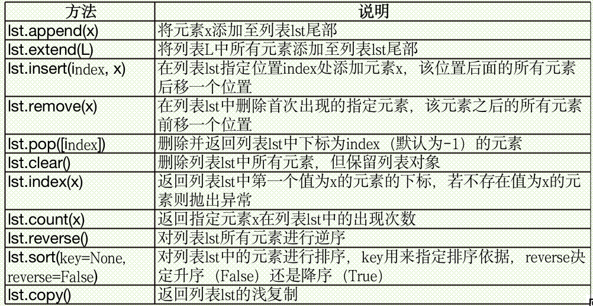

# python序列概述

* python序列类似于其他语言中的数组，但功能要强大很多。
* python中常用的序列结构有列表、元组、字符串，字典、集合以及range等对象也支持很多类似操作
* 列表、元组、字符串支持**双向索引**，
  * 第一个元素下标为0，第二个元素下标为1，以此类推；
  * **最后一个元素下标为-1**,倒数第二个元素下标为-2，以此类推。


# 列表

* 列表是python中内置有序可变序列，列表的所有元素放在一对中括号“[]“中，并使用都好分割开；
* 当列表元素增加或删除时，列表对象自动进行扩展或收缩内存，保证元素之间没有缝隙；
* 在python中，一个列表中的数据类型可以各不相同，可以同时分别为整数、实数、字符串等基本类型，甚至是列表、元组、字典、集合以及其他自定义类型的对象。

```
[10, 20, 30, 40]
['crunchy frog', 'ram bladder', 'lark vomit']
['spam', 2.0, 5, [10, 20]]
[['file1', 200,7], ['file2', 260,9]]
```

## 列表常用方法


### 列表创建与删除

* 使用“=”直接将一个**列表赋值给变量**即可创建列表对象。

> \>>> a_list = ['a', 'b', 'mpilgrim', 'z', 'example']
> \>>> a_list =[ ]         #创建空列表

* 也可以**使用list()函数**将元组、range对象、字符串或其他类型的可迭代对象类型的数据转换成列表。

``` javascript{.line-numbers}
>>>a_list = list((3,5,7,9,11))
>>>a_list
[3,5,7,9,11]
>>>list(range(1,10,2))
[1,3,5,7,9]

#备注：range()函数用法如下：
#range(stop)
#range(start, stop[, step])
#参数说明：
#start: 计数从 start 开始。默认是从 0 开始。例如range（5）等价于range（0， 5）;
#stop: 计数到 stop 结束，但不包括 stop。例如：range（0， 5） 是[0, 1, 2, 3, 4]没有5
#step：步长，默认为1。例如：range（0， 5） 等价于 range(0, 5, 1)

>>>list('hello world')
['h','e','l','l','o','','w','o','r','l','d']
>>>x = list() #创建空列表
```

* 当不再使用时，使用del命令删除整个列表，如果列表对象所指向的值不再有其他对象指向，python将同时删除该值。

``` javascript{.line-numbers}
>>> del a_list
>>> a_list
Traceback (most recent call last):
  File "<pyshell#6>", line 1, in <module>
    a_list
NameError: name 'a_list' is not defined
```

### 列表元素增加

#### “+”运算符
1. 可以使用“+”运算符将元素添加到列表中。
```
>>> aList = [3,4,5]
>>> aList = aList + [7]
>>> aList
[3, 4, 5, 7]
```
严格意义上来讲，这并不是真的为列表添加元素，而是**创建一个新列表**，并将元列表中的元素和新元素依次复制到新列表的内存空间。由于涉及大量元素的复制，该操作速度较慢，在涉及大量元素添加时不建议使用该方法。

#### append()方法
2. 使用列表对象的**append()方法**，原地修改列表，是真正意义上的在列表尾部添加元素，速度较快。
```
>>> aList.append(9)
>>> aList
[3, 4, 5, 7, 9]
```
所谓“原地”，是指**不改变列表在内存中的首地址。**

python采用的是**基于值的自动内存管理方式**，当为对象修改值时，并不是真的直接修改变量的值，而是使变量指向新的值，这对于python所有类型的变量都是一样的。

```
>>> a = [1,2,3]
>>> id(a)                        #返回对象的内存地址
20230752
>>> a = [1,2]
>>> id(a)
20338208
```
**列表中**包含的是**元素值的引用**，而**不是直接包含元素值**。如果是直接修改序列变量的值，则与Python普通变量的情况是一样的，而如果是通过下标来修改序列中元素的值或通过可变序列对象自身提供的方法来增加和删除元素时，序列对象在内存中的起始地址是不变的，仅仅是被改变值的元素地址发生变化，也就是所谓的“原地操作”。

```javascript{.line-numbers}
>>> a = [1,2,4]
>>> b = [1,2,3]
>>> a == b
False
>>> id(a) == id(b)
False
>>> id(a[0]) == id(b[0])
True
>>> a = [1,2,3]
>>> id(a)
25289752
>>> a.append(4)
>>> id(a)
25289752

>>> a.remove(3)
>>> a
[1, 2, 4]
>>> id(a)
25289752
>>> a[0] = 5
>>> a
[5, 2, 4]
>>> id(a)
25289752
```

#### extend()方法
3.使用列表对象的extend()方法可以将另一个迭代对象的所有元素添加至该列表对象尾部。通过extend()方法来增加列表元素也不改变其内存首地址，属于原地操作。

```javascript{.line-numbers}
>>> a.extend([7,8,9])
>>> a
[5, 2, 4, 7, 8, 9]
>>> aList.extend([11,13])
>>> aList
[3, 4, 5, 7, 9, 11, 13]
>>> aList.extend((15,17))
>>> aList
[3, 4, 5, 7, 9, 11, 13, 15, 17]
>>> id(a)
25289752
```

#### insert()方法
4. 使用列表对象的insert()方法将元素添加至列表的指定位置。

```
>>> aList.insert(3, 6)     #在下标为3的位置插入元素6
>>> aList
[3, 4, 5, 6, 7, 9, 11, 13, 15, 17]
```

应尽量从列表尾部进行元素的增加与删除操作。
* 列表的insert()可以在列表的任意位置插入元素，但由于列表的自动内存管理功能，insert()方法会涉及到插入位置之后所有元素的移动，这会影响处理速度。
* 蕾丝的还有remove()方法以及使用pop()函数弹出列表非尾部元素和使用del命令删除列表非尾部元素的情况。

```javascript{.line-numbers}
import time

def Insert():
    a = []
    for i in range(10000):
        a.insert(0, i)

def Append():
    a = []
    for i in range(10000):
        a.append(i)

start = time.time()
for i in range(10):
    Insert()
print('Insert:', time.time()-start)

start = time.time()
for i in range(10):
    Append()
print('Append:', time.time()-start)
```
代码运行结果如下；
Insert: 0.578000068665
Append: 0.0309998989105

#### *乘法扩展
5. 使用乘法来扩展列表对象，将列表与整数相乘，生成一个新列表，新列表是原列表中元素的重复。

```javascript{.line-numbers}
>>> aList = [3,5,7]
>>> bList = aList
>>> id(aList)
57091464
>>> id(bList)
57091464
>>> aList = aList*3
>>> aList
[3, 5, 7, 3, 5, 7, 3, 5, 7]
>>> bList
[3,5,7]
>>> id(aList)
57092680
>>> id(bList)
57091464
```

当使用** \*运算符 将包含列表的列表重复创建新列表时，并不创建元素的复制，而是创建已有对象的引用**。因此，当修改其中一个值时，响应的引用也会被修改。

```javascript{.line-numbers}
>>> x = [[None] * 2] * 3
>>> x
[[None, None], [None, None], [None, None]]
>>> x[0][0] = 5
>>> x
[[5, None], [5, None], [5, None]]
>>> x = [[1,2,3]] * 3
>>> x[0][0] = 10
>>> x
[[10, 2, 3], [10, 2, 3], [10, 2, 3]]
```

### 列表元素删除

#### del命令
1. 使用del命令删除列表中的指定位置上的元素。

```javascript{.line-numbers}
>>> a_list = [3,5,7,9,11]
>>> del a_list[1]
>>> a_list
[3, 7, 9, 11]
```
#### pop()方法
2. 使用列表的pop()方法删除并返回指定（默认为最后一个）位置上的元素，如果给定的索引超出了列表的范围则抛出异常。

```javascript{.line-numbers}
>>> a_list = list((3,5,7,9,11))
>>> a_list.pop()
11
>>> a_list
[3, 5, 7, 9]
>>> a_list.pop(1)
5
>>> a_list
[3, 7, 9]
```
#### remove()方法
3. 使用列表对象的remove()方法删除首次出现的指定元素，如果列表中不存在要删除的元素，则抛出异常。

```javascript{.line-numbers}
>>> a_list = [3,5,7,9,7,11]
>>> a_list.remove(7)
>>> a_list
[3, 5, 9, 7, 11]
```
代码编写好后必须要经过反复测试，不能满足于几次测试结果正确。例如，下面的代码成功滴删除了列表中的重复元素，执行结果是完全正确的。
```
>>> x = [1,2,1,2,1,2,1,2,1]
>>> for i in x:
	    if i == 1:
		  x.remove(i)		
>>> x
[2, 2, 2, 2]
```
然而，上面这段代码的逻辑是错误的。同样的代码，仅仅是所处理的数据发生了一点变化，然而当循环结束后却发现并没有把所有的“1”都删除，只是删除了一部分。
```
>>> x = [1,2,1,2,1,1,1]
>>> for i in x:
	       if i == 1:
		x.remove(i)		
>>> x
[2, 2, 1]
```
两组数据的本质区别在于，第一组数据中没有连续的“1”，而第二组数据中存在连续的“1”。出现这个问题的原因是列表的自动内存管理功能。
在删除列表元素时，Python会自动对列表内存进行收缩并移动列表元素以保证所有元素之间没有空隙，增加列表元素时也会自动扩展内存并对元素进行移动以保证元素之间没有空隙。每当插入或删除一个元素之后，该元素位置后面所有元素的索引就都改变了。
正确的代码：
```
>>> x = [1,2,1,2,1,1,1]
>>> for i in x[::]:                             #切片
       if i == 1:
		x.remove(i)
```
或者：
```
>>> x = [1,2,1,2,1,1,1]
>>> for i in range(len(x)-1,-1,-1):
	        if x[i]==1:
		del x[i]
```	
### 列表元素访问与计数

#### 下标访问
使用下标直接访问列表元素，如果指定下标不存在，则抛出异常。
```javascript{.line-numbers}
>>> aList[3]
6
>>> aList[3] = 5.5
>>> aList
[3, 4, 5, 5.5, 7, 9, 11, 13, 15, 17]
>>> aList[15]
Traceback (most recent call last):
  File "<pyshell#34>", line 1, in <module>
    aList[15]
IndexError: list index out of range
```

#### index()方法访问
使用列表对象的index()方法获取指定元素首次出现的下标，若列表对象中不存在指定元素，则抛出异常。
```javascript{.line-numbers}
>>> aList
[3, 4, 5, 5.5, 7, 9, 11, 13, 15, 17]
>>> aList.index(7)
4
>>> aList.index(100)
Traceback (most recent call last):
  File "<pyshell#36>", line 1, in <module>
    aList.index(100)
ValueError: 100 is not in list
```

#### count()方法计数

使用列表对象的count()方法统计指定元素在列表对象中出现的次数
```javascript{.line-numbers}
>>> aList
[3, 4, 5, 5.5, 7, 9, 11, 13, 15, 17]
>>> aList.count(7)
1
>>> aList.count(0)
0
>>> aList.count(8)
0
```

### 成员资格判断
如果需要判断列表中是否存在指定的值，可以使用count()方法，如果存在则返回大于0的数，如果返回0则表示不存在。或者，使用更加简洁的“in”关键字来判断一个值是否存在于列表中，返回结果为“True”或“False”。

```javascript{.line-numbers}
>>> aList
[3, 4, 5, 5.5, 7, 9, 11, 13, 15, 17]
>>> 3 in aList
True
>>> 18 in aList
False
>>> bList = [[1], [2], [3]]
>>> 3 in bList
False
```

### 切片操作
* 切片是Python序列的重要操作之一，适用于列表、元组、字符串、range对象等类型。
* 切片使用2个冒号分隔的3个数字来完成，
  * 第一个数字表示切片开始位置（默认为0），
  * 第二个数字表示切片截止（但不包含）位置（默认为列表长度），
  * 第三个数字表示切片的步长（默认为1），
  * 当步长省略时可以顺便省略最后一个冒号。可以使用切片来截取列表中的任何部分，得到一个新列表，也可以通过切片来修改和删除列表中部分元素，甚至可以通过切片操作为列表对象增加元素。
* 切片操作不会因为下标越界而抛出异常，而是简单地在列表尾部截断或者返回一个空列表，代码具有更强的健壮性。

```javascript{.line-numbers}
>>> aList = [3, 4, 5, 6, 7, 9, 11, 13, 15, 17]
>>> aList[::]          #返回包含元素的新列表
[3, 4, 5, 6, 7, 9, 11, 13, 15, 17]
>>> aList[::-1]        #逆序的所有元素
[17, 15, 13, 11, 9, 7, 6, 5, 4, 3]
>>> aList[::2]         #偶数位置，隔一个取一个
[3, 5, 7, 11, 15]
>>> aList[1::2]        #奇数位置，隔一个取一个
[4, 6, 9, 13, 17]
>>> aList[3::]         #从下标3开始的所有元素
[6, 7, 9, 11, 13, 15, 17]
>>> aList[3:6]         #下标在[3, 6)之间的所有元素
[6, 7, 9]
>>> aList[0:100:1]     #前100个元素，自动截断
[3, 4, 5, 6, 7, 9, 11, 13, 15, 17]
>>> a[100:]            #下标100之后的所有元素，自动截断
[]
>>> x[100]             #直接使用下标访问会发生越界
IndexError: list index out of range
```
#### 切片原地修改列表

可以使用切片来**原地修改**列表内容

```javascript{.line-numbers}
>>> aList = [3, 5, 7]
>>> aList[len(aList):] = [9]     #在尾部追加元素
>>> aList
[3, 5, 7, 9]
>>> aList[:3] = [1, 2, 3]     #替换前3个元素
>>> aList
[1, 2, 3, 9]
>>> aList[:3] = []      #删除前3个元素
>>> aList
[9]
>>> aList = list(range(10))
>>> aList
[0, 1, 2, 3, 4, 5, 6, 7, 8, 9]
>>> aList[::2] = [0]*5        #替换偶数位置上的元素
>>> aList
[0, 1, 0, 3, 0, 5, 0, 7, 0, 9]
>>> aList[::2] = [0]*3     #切片不连续，两个元素个数必须一样多
ValueError: attempt to assign sequence of size 3 to extended slice of size 5
```

#### 切片配合del删除列表元素

使用del与切片结合来删除列表元素

```javascript{.line-numbers}
>>> aList = [3,5,7,9,11]
>>> del aList[:3]                          #删除前3个元素
>>> aList
[9, 11]

>>> aList = [3,5,7,9,11]
>>> del aList[::2]                         #删除偶数位置上的元素
>>> aList
[5, 9]
```

#### 切片浅复制列表元素

切片返回的是列表元素的浅复制

```javascript{.line-numbers}
>>> aList = [3, 5, 7]
>>> bList = aList              #bList与aList指向同一个内存
>>> bList
[3, 5, 7]
>>> bList[1] = 8                #修改其中一个对象会影响另一个
>>> aList
[3, 8, 7]
>>> aList == bList             #两个列表的元素完全一样
True
>>> aList is bList              #两个列表是同一个对象
True
>>> id(aList)                     #内存地址相同
19061816
>>> id(bList)
19061816
```

所谓浅复制，是指生成一个新的列表，并且把原列表中所有元素的引用都复制到新列表中。如果原列表中只包含整数、实数、复数等基本类型或元组、字符串这样的不可变类型的数据，一般是没有问题的。如果原列表中包含列表之类的可变数据类型，由于浅复制时只是把子列表的引用复制到新列表中，这样的话修改任何一个都会影响另外一个。

```javascript{.line-numbers}
>>> aList = [3, 5, 7]
>>> bList = aList[::]                 #切片，浅复制
>>> aList == bList                    #两个列表的元素完全一样
True
>>> aList is bList                    #但不是同一个对象
False
>>> id(aList) == id(bList)            #内存地址不一样
False
>>> bList[1] = 8                      #修改其中一个不会影响另一个
>>> bList
[3, 8, 7]
>>> aList
[3, 5, 7]
```
### 列表排序

使用列表对象的sort方法进行原地排序，支持多种不同的排序方

```javascript{.line-numbers}
>>> aList = [3, 4, 5, 6, 7, 9, 11, 13, 15, 17]
>>> import random
>>> random.shuffle(aList)
>>> aList
[3, 4, 15, 11, 9, 17, 13, 6, 7, 5]
>>> aList.sort()                                              #默认是升序排序
>>> aList.sort(reverse = True)     #降序排序
>>> aList
[17, 15, 13, 11, 9, 7, 6, 5, 4, 3]
>>> aList.sort(key = lambda x:len(str(x)))   #按转换成字符串的长度排序
>>> aList
[9, 7, 6, 5, 4, 3, 17, 15, 13, 11]
```

使用内置函数sorted对列表进行排序并返回新列表

```javascript{.line-numbers}
>>> aList
[9, 7, 6, 5, 4, 3, 17, 15, 13, 11]
>>> sorted(aList)                                     #升序排序
[3, 4, 5, 6, 7, 9, 11, 13, 15, 17]
>>> sorted(aList,reverse = True)             #降序排序
[17, 15, 13, 11, 9, 7, 6, 5, 4, 3]
```

使用列表对象的reverse方法将元素原地逆序

```javascript{.line-numbers}
>>> aList = [3, 4, 5, 6, 7, 9, 11, 13, 15, 17]
>>> aList.reverse()
>>> aList
[17, 15, 13, 11, 9, 7, 6, 5, 4, 3]
```

使用内置函数reversed方法对列表元素进行逆序排列并返回迭代对象

```javascript{.line-numbers}
>>> aList = [3, 4, 5, 6, 7, 9, 11, 13, 15, 17]
>>> newList = reversed(aList)     #返回reversed对象
>>> list(newList)        #把reversed对象转换成列表
[17, 15, 13, 11, 9, 7, 6, 5, 4, 3]
>>> for i in newList:
	   print(i, end=' ')   #这里没有输出内容
                        #迭代对象已遍历结束
>>> newList = reversed(aList)   #重新创建reversed对象
>>> for i in newList:
	   print(i, end=' ')
17 15 13 11 9 7 6 5 4 3
```

### 用于序列操作的常用内置函数

* len(列表)：返回列表中的元素个数，同样适用于元组、字典、集合、字符串等。
* max(列表)、 min(列表)：返回列表中的最大或最小元素，同样适用于元组、字典、集合、range对象等。
* sum(列表)：对列表的元素进行求和运算，对非数值型列表运算需要指定start参数，同样适用于元组、range。

```javascript{.line-numbers}
>>> sum(range(1, 11))               #sum()函数的start参数默认为0
55
>>> sum(range(1, 11), 5)           #指定start参数为5，等价于5+sum(range(1,11))
60
>>> sum([[1, 2], [3], [4]], [])         #这个操作占用空间较大，慎用
[1, 2, 3, 4]
```

* zip()函数返回可迭代的zip对象。

```javascript{.line-numbers}
>>> aList = [1, 2, 3]
>>> bList = [4, 5, 6]
>>> cList = zip(aList, bList)     #返回zip对象
>>> cList
<zip object at 0x0000000003728908>
>>> list(cList)                                         #把zip对象转换成列表
[(1, 4), (2, 5), (3, 6)]
```

enumerate(列表):枚举列表元素，返回枚举对象，其中每个元素为包含下标和值的元组。该函数对元组、字符串同样有效。

```javascript{.line-numbers}
>>> for item in enumerate('abcdef'):
	print(item)

(0, 'a')
(1, 'b')
(2, 'c')
(3, 'd')
(4, 'e')
(5, 'f')
```

### 列表推导式

#### 列表推导式使用非常简洁的方式来快速生成满足特定需求的列表，代码具有非常强的可读性。

> \>>> aList = [x*x for x in range(10)]

相当于

```javascript
>>> aList = []
>>> for x in range(10):
	    aList.append(x*x)
```

也相当于

> \>>> aList = list(map(lambda x: x*x, range(10)))

阿凡提与国王比赛下棋，国王说要是自己输了的话阿凡提想要什么他都可以拿得出来。阿凡提说那就要点米吧，棋盘一共64个小格子，在第一个格子里放1粒米，第二个格子里放2粒米，第三个格子里放4粒米，第四个格子里放8粒米，以此类推，后面每个格子里的米都是前一个格子里的2倍，一直把64个格子都放满。需要多少粒米呢？

> \>>> sum([2**i for i in range(64)])
> 18446744073709551615

#### 使用列表推导式实现嵌套列表的平铺

```javascript{.line-numbers}
>>> vec = [[1,2,3], [4,5,6], [7,8,9]] 
>>> [num for elem in vec for num in elem] 
[1, 2, 3, 4, 5, 6, 7, 8, 9] 
```

相当于

```javascript{.line-numbers}
>>> vec = [[1, 2, 3], [4, 5, 6], [7, 8, 9]]
>>> result = []
>>> for elem in vec:
	  for num in elem:
		result.append(num)
>>> result
[1, 2, 3, 4, 5, 6, 7, 8, 9]
```

如果不使用列表推导式，可以这样做

```javascript{.line-numbers}
>>> vec = [[1, 2, 3], [4, 5, 6], [7, 8, 9]]
>>> sum(vec, [])
[1, 2, 3, 4, 5, 6, 7, 8, 9]
```

或

```javascript{.line-numbers}
>>> vec = [[1, 2, 3], [4, 5, 6], [7, 8, 9]]
>>> from itertools import chain
>>> list(chain(*vec))
[1, 2, 3, 4, 5, 6, 7, 8, 9]
```

列出当前文件夹下所有Python源文件

```javascript{.line-numbers}
>>> import os
>>> [filename for filename in os.listdir('.') if filename.endswith(('.py', '.pyw'))]
```

过滤不符合条件的元素

```javascript{.line-numbers}
>>> aList = [-1,-4,6,7.5,-2.3,9,-11]
>>> [i for i in aList if i>0]
[6, 7.5, 9]
```

已知有一个包含一些同学成绩的字典，计算成绩的最高分、最低分、平均分，并查找所有最高分同学。

```javascript{.line-numbers}
>>> scores = {"Zhang San": 45, "Li Si": 78, "Wang Wu": 40, "Zhou Liu": 96, "Zhao Qi": 65, "Sun Ba": 90, "Zheng Jiu": 78, "Wu Shi": 99, "Dong Shiyi": 60}
>>> highest = max(scores.values())
>>> lowest = min(scores.values())
>>> average = sum(scores.values())*1.0/len(scores)
>>> highest, lowest, average
99  40  72.33333333333333
>>> highestPerson = [name for name, score in scores.items() if score == highest]
>>> highestPerson
['Wu Shi']
```

#### 在列表推导式中使用多个循环，实现多序列元素的任意组合，并且可以结合条件语句过滤特定元素

```javascript{.line-numbers}
>>> [(x, y) for x in range(3) for y in range(3)]
[(0, 0), (0, 1), (0, 2), (1, 0), (1, 1), (1, 2), (2, 0), (2, 1), (2, 2)]
>>> [(x, y) for x in [1, 2, 3] for y in [3, 1, 4] if x != y]
[(1, 3), (1, 4), (2, 3), (2, 1), (2, 4), (3, 1), (3, 4)]
```

#### 使用列表推导式实现矩阵转置

```javascript{.line-numbers}
>>>matrix = [ [1, 2, 3, 4], [5, 6, 7, 8], [9, 10, 11, 12]] 
>>> [[row[i] for row in matrix] for i in range(4)] 
[[1, 5, 9], [2, 6, 10], [3, 7, 11], [4, 8, 12]] 
```

也可以使用内置函数来实现矩阵转置

```javascript{.line-numbers}
>>>list(zip(*matrix))       #序列解包
 [(1, 5, 9), (2, 6, 10), (3, 7, 11), (4, 8, 12)] 
```

列表推导式中可以使用函数或复杂表达式

```javascript{.line-numbers}
>>> def f(v):
    if v%2 == 0:
        v = v**2
    else:
        v = v+1
    return v

>>> [f(v) for v in [2, 3, 4, -1] if v>0]
[4, 4, 16]
>>> [v**2 if v%2 == 0 else v+1 for v in [2, 3, 4, -1] if v>0]
[4, 4, 16]
```

#### 列表推导式支持文件对象迭代 

```javascript{.line-numbers}
>>> with open('C:\\RHDSetup.log', 'r') as fp: 
        print([line for line in fp])
```

#### 使用列表推导式生成100以内的所有素数

```javascript{.line-numbers}
>>> [p for p in range(2, 100) if 0 not in [p%d for d in range(2, int(p**0.5)+1)]]
[2, 3, 5, 7, 11, 13, 17, 19, 23, 29, 31, 37, 41, 43, 47, 53, 59, 61, 67, 71, 73, 79, 83, 89, 97]
```

### 使用列表实现向量运算

```javascript{.line-numbers}
>>> import random
>>> x = [random.randint(1,100) for i in range(10)] #生成随机数
>>> list(map(lambda i: i+5, x))                               #所有元素同时加5
>>> x = [random.randint(1,10) for i in range(10)]
>>> y = [random.randint(1,10) for i in range(10)]
>>> import operator
>>> sum(map(operator.mul, x, y))             #向量内积
>>> sum((i*j for i, j in zip(x, y)))                 #向量内积
>>> list(map(operator.add, x, y))               #两个等长的向量对应元素相加
```