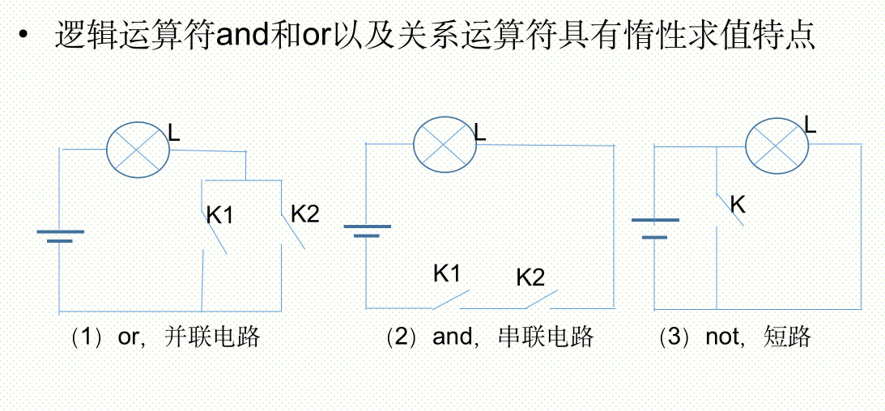

# 条件表达式

* 算术运算符：+、-、*、/、//、%、**
* 关系运算符：>、<、==、<=、>=、!=，可以连续使用，如

```javascript{.line-numbers}
>>> 1<2<3
True
>>> 1<2>3
False
>>> 1<3>2
True
```

* 测试运算符：in、not in、is、is not
* 逻辑运算符：and、or、not，注意短路求值
* 位运算符：~、&、|、 ^、 <<、>>
* 矩阵乘法运算符：@

* 在选择和循环结构中，条件表达式的值只要不是False、0（或0.0、0j等）、空值None、空列表、空元组、空集合、空字典、空字符串、空range对象或其他空迭代对象，Python解释器均认为与True等价。
* 从这个意义上来讲，几乎所有的Python合法表达式都可以作为条件表达式，包括含有函数调用的表达式。

```javascript{.line-numbers}
>>> if 3:              #使用整数作为条件表达式
	    print(5)
5
>>> a = [1, 2, 3]
>>> if a:              #使用列表作为条件表达式
	    print(a)	
[1, 2, 3]
>>> a = []
>>> if a:
	    print(a)
else:
    print('empty')

empty

>>> i = s = 0
>>> while i <= 10:              #使用关系表达式作为条件表达式
    s += i
    i += 1
>>> print(s)
55
>>> i = s = 0
>>> while True:                    #使用常量True作为条件表达式
    s += i
    i += 1
    if i > 10:
		break
>>> print(s)
55
>>> s = 0
>>> for i in range(0, 11, 1):   #遍历迭代对象中的所有元素
    s += i
>>> print(s)
55

```

逻辑运算符and和or以及关系运算符具有惰性求值特点



* 比较特殊的运算符还有逻辑运算符“and”和“or”以及关系运算符，具有短路求值或惰性求值的特点，只计算必须计算的表达式的值。
* 以“and”为例，对于表达式“表达式1 and 表达式2”而言，如果“表达式1”的值为“False”或其他等价值时，不论“表达式2”的值是什么，整个表达式的值都是“False”，此时“表达式2”的值无论是什么都不影响整个表达式的值，因此将不会被计算，从而减少不必要的计算和判断。

在设计条件表达式时，如果能够大概预测不同条件失败的概率，并将多个条件根据“and”和“or”运算的短路求值特性进行组织，可以大幅度提高程序运行效率。下面的函数用来使用用户指定的分隔符将多个字符串连接成一个字符串，如果用户没有指定分隔符则使用逗号。

```javascript{.line-numbers}
>>> def Join(chList, sep=None):
	    return (sep or ',').join(chList)
>>> chTest = ['1', '2', '3', '4', '5']
>>> Join(chTest)
'1,2,3,4,5'
>>> Join(chTest, ':')
'1:2:3:4:5'
>>> Join(chTest, ' ')
'1 2 3 4 5'
```

另外，在Python中，条件表达式中不允许使用赋值运算符“=”，避免了其他语言中误将关系运算符“==”写作赋值运算符“=”带来的麻烦，例如下面的代码，在条件表达式中使用赋值运算符“=”将抛出异常，提示语法错误。

```javascript{.line-numbers}
>>> if a=3:
SyntaxError: invalid syntax
>>> if (a=3) and (b=4):	
SyntaxError: invalid syntax
```

# 选择结构

## 单分支选择结构

```
if 表达式:
    语句块
```

```javascript{.line-numbers}
x = input('Input two number:')
a, b = map(int, x.split())
if a > b:
   a, b = b, a        #序列解包，交换两个变量的值
print(a, b)
```
## 双分支结构

if 表达式:
    语句块1
else:
    语句块2

```javascript{.line-numbers}
>>> chTest = ['1', '2', '3', '4', '5']
>>> if chTest:
	  print(chTest)
else:
	  print('Empty')

['1', '2', '3', '4', '5']
```

Python还支持如下形式的表达式：
> value1 if condition else value2

当条件表达式condition的值与True等价时，表达式的值为value1，否则表达式的值为value2。另外，在value1和value2中还可以使用复杂表达式，包括函数调用和基本输出语句。这个结构的表达式也具有惰性求值的特点。

```javascript{.line-numbers}
>>> a = 5
>>> print(6) if a>3 else print(5)
6
>>> print(6 if a>3 else 5)
6
>>> b = 6 if a>13 else 9
>>> b
9

#此时还没有导入math模块
>>> x = math.sqrt(9) if 5>3 else random.randint(1, 100)
NameError: name 'math' is not defined
>>> import math
#此时还没有导入random模块，但由于条件表达式5>3的值为True，所以可以正常运行
>>> x = math.sqrt(9) if 5>3 else random.randint(1,100) 
#此时还没有导入random模块，由于条件表达式2>3的值为False，需要计算第二个表达式的值，因此出错
>>> x = math.sqrt(9) if 2>3 else random.randint(1, 100)
NameError: name 'random' is not defined
>>> import random
>>> x = math.sqrt(9) if 2>3 else random.randint(1, 100)
```

## 多分支结构

```
if 表达式1:
    语句块1
elif 表达式2:
    语句块2
elif 表达式3:
    语句块3
else:
    语句块4
```

其中，关键字elif是else if的缩写。

利用多分支选择结构将成绩从百分制变换到等级制

```javascript{.line-numbers}
def func(score):
	    if score > 100:
		return 'wrong score.must <= 100.'
	    elif score >= 90:
		return 'A'
    elif score >= 80:
		return 'B'
    elif score >= 70:
		return 'C'
    elif score >= 60:
		return 'D'
    elif score >= 0:
		return 'E'
    else:
		return 'wrong score.must >0'	
```

## 选择结构的嵌套

```
if 表达式1:
    语句块1
    if 表达式2:
        语句块2
    else:
        语句块3
else:
    if 表达式4:
        语句块4
```

注意：缩进必须要正确并且一致。


使用嵌套的选择结构实现百分制成绩到等级制的转换

```javascript{.line-numbers}
>>> def func(score):
	    degree = 'DCBAAE'
	    if score > 100 or score < 0:
        return 'wrong score.must between 0 and 100.'
    else:
        index = (score - 60)//10
        if index >= 0:
            return degree[index]
        else:
		     return degree[-1]
```

## 构建跳转表实现多分支选择结构

使用列表、元组或字典可以很容易构建跳转表，在某些场合下可以更快速地实现类似于多分支选择结构的功能。

```javascript{.line-numbers}
funcDict = {'1':lambda:print('You input 1'),
            '2':lambda:print('You input 2'),
            '3':lambda:print('You input 3')}
x = input('Input an integer to call different function:')
func = funcDict.get(x, None)
if func:
    func()
else:
    print('Wrong integer.')
```

## 选择结构应用

例3-1：面试资格确认。

```javascript{.line-numbers}
age=24
subject="计算机"
college="非重点"
if (age > 25 and subject=="电子信息工程") or (college=="重点" and subject=="电子信息工程" ) or (age<=28 and subject=="计算机"):
    print("恭喜，你已获得我公司的面试机会!")
else:
    print("抱歉，你未达到面试要求")
```

例3-2：用户输入若干个分数，求所有分数的平均分。每输入一个分数后询问是否继续输入下一个分数，回答“yes”就继续输入下一个分数，回答“no”就停止输入分数。

```javascript{.line-numbers}
numbers = []                                  #使用列表存放临时数据
while True:
    x = input('请输入一个成绩：')
    try:                                      #异常处理结构有关知识见第11章
        numbers.append(float(x))
    except:
        print('不是合法成绩')
    while True:
        flag = input('继续输入吗？（yes/no）')
        if flag.lower() not in ('yes', 'no'):  #限定用户输入内容必须为yes或no
            print('只能输入yes或no')
        else:
            break
    if flag.lower()=='no':
        break

print(sum(numbers)/len(numbers))
```

例3-3：编写程序，判断今天是今年的第几天。

```javascript{.line-numbers}
import time

date = time.localtime()                                                 #获取当前日期时间
year, month, day = date[:3]
day_month = [31, 28, 31, 30, 31, 30, 31, 31, 30, 31, 30, 31]

if year%400==0 or (year%4==0 and year%100!=0):   #判断是否为闰年
    day_month[1] = 29

if month==1:
    print(day)
else:
    print(sum(day_month[:month-1])+day)
```

其中闰年判断可以直接使用calendar模块的方法。

```javascript{.line-numbers}
>>> calendar.isleap(2016)
True
>>> calendar.isleap(2015)
False
```

或者使用下面的方法直接计算今天是今年的第几天

```javascript{.line-numbers}
>>> datetime.date.today().timetuple().tm_yday
208
>>> datetime.date(2015,7,25).timetuple().tm_yday
206
```

也可以使用datetime模块提供的功能来计算

```javascript{.line-numbers}
>>> today = datetime.date.today()
>>> today
datetime.date(2015, 7, 27)
>>> firstDay = datetime.date(today.year,1,1)
>>> firstDay
datetime.date(2015, 1, 1)
>>> daysDelta = today-firstDay+datetime.timedelta(days=1)
>>> daysDelta.days
208
```

datetime还提供了其他功能

```javascript{.line-numbers}
>>> now = datetime.datetime.now()
>>> now
datetime.datetime(2015, 12, 6, 16, 1, 6, 313898)
>>> now.replace(second=30)                  #替换日期时间中的秒
datetime.datetime(2015, 12, 6, 16, 1, 30, 313898)
>>> now+datetime.timedelta(days=5)     #计算5天后的日期时间
datetime.datetime(2015, 12, 11, 16, 1, 6, 313898)
>>> now + datetime.timedelta(weeks=-5)  #计算5周前的日期时间
datetime.datetime(2015, 11, 1, 16, 1, 6, 313898)
```

# for循环与while循环

* Python提供了两种基本的循环结构语句——while语句、for语句。
* while循环一般用于循环次数难以提前确定的情况，也可以用于循环次数确定的情况。
* for循环一般用于循环次数可以提前确定的情况，尤其是用于枚举序列或迭代对象中的元素。
* 一般优先考虑使用for循环。
* 相同或不同的循环结构之间都可以互相嵌套，实现更为复杂的逻辑。

```
while 条件表达式:
	循环体
[else:
	else子句代码块]


for 取值 in 序列或迭代对象:
	循环体
[else:
    else子句代码块]
```

## 循环结构的优化

为了优化程序以获得更高的效率和运行速度，在编写循环语句时，应尽量减少循环内部不必要的计算，将与循环变量无关的代码尽可能地提取到循环之外。对于使用多重循环嵌套的情况，应尽量减少内层循环中不必要的计算，尽可能地向外提。

优化前的代码：

```javascript{.line-numbers}
digits = (1, 2, 3, 4)

for i in range(1000):
    result = []
    for i in digits:
        for j in digits:
            for k in digits:
                result.append(i*100+j*10+k)
```

优化后的代码：

```javascript{.line-numbers}
for i in range(1000):
    result = []
    for i in digits:
        i = i*100
        for j in digits:
            j = j*10
            for k in digits:
                result.append(i+j+k)
```

另外，在循环中应尽量引用局部变量，因为局部变量的查询和访问速度比全局变量略块，在使用模块中的方法时，可以通过将其转换为局部变量来提高运行速度。

```javascript{.line-numbers}
import time
import math

start = time.time() #获取当前时间
for i in xrange(10000000):
    math.sin(i)
print('Time Used:', time.time()-start) #输出所用时间

loc_sin = math.sin
start = time.time()
for i in xrange(10000000):
    loc_sin(i)
print('Time Used:', time.time()-start)
```

# break和continue语句

* break语句在while循环和for循环中都可以使用，一般放在if选择结构中，一旦break语句被执行，将使得整个循环提前结束。
* continue语句的作用是终止当前循环，并忽略continue之后的语句，然后回到循环的顶端，提前进入下一次循环。
* 除非break语句让代码更简单或更清晰，否则不要轻易使用。

下面的代码用来计算小于100的最大素数，注意break语句和else子句的用法。

```javascript{.line-numbers}
>>> for n in range(100, 1, -1):
    for i in range(2, n):
		if n%i == 0:
			break
    else:
		print(n)
		break	

97
```

删除上面代码中最后一个break语句，则可以用来输出100以内的所有素数。

```javascript{.line-numbers}
>>> for n in range(100, 1, -1):
    for i in range(2, n):
		if n%i == 0:
		    break
    else:
		print(n, end=' ')

97 89 83 79 73 71 67 61 59 53 47 43 41 37 31 29 23 19 17 13 11 7 5 3 2
```

警惕continue可能带来的问题：

```javascript{.line-numbers}
>>> i=0
>>> while i<10:
	  if i%2==0:
		  continue
	  print(i)
	  i+=1
```
永不结束的死循环,Ctrl+C强行终止。

这样子就不会有问题

```javascript{.line-numbers}
>>> for i in range(10):
	  if i%2==0:
		  continue
	  print(i, end=' ')

1 3 5 7 9

>>> for i in range(10):
	  if i%2==0:
		  i+=1       #没有用呀没有用
		  continue
	  print(i, end=' ')

1 3 5 7 9
```

每次进入循环时的i已经不再是上一次的i，所以修改其值并不会影响循环的执行。

```javascript{.line-numbers}
>>> for i in range(7):	
	  print(id(i),':',i)
10416692 : 0
10416680 : 1
10416668 : 2
10416656 : 3
10416644 : 4
10416632 : 5
10416620 : 6
```

例3-4：计算1+2+3+…+100 的值。

```javascript{.line-numbers}
s=0
for i in range(1,101):
    s = s + i
print('1+2+3+…+100 = ', s)
print('1+2+3+…+100 = ', sum(range(1,101)))
```

例3-5：输出序列中的元素。

```javascript{.line-numbers}
a_list=['a', 'b', 'mpilgrim', 'z', 'example']
for i,v in enumerate(a_list):
    print('列表的第', i+1, '个元素是：', v)
```

例3-6：求1~100之间能被7整除，但不能同时被5整除的所有整数 。

```javascript{.line-numbers}
for i in range(1,101):
	if i % 7 == 0 and i % 5 != 0:
		print(i)
```

例3-7：输出“水仙花数”。所谓水仙花数是指1个3位的十进制数，其各位数字的立方和等于该数本身。例如：153是水仙花数，因为153 = 13 + 53 + 33 。

```javascript{.line-numbers}
for i in range(100, 1000):
    #这里是序列解包的用法
    bai, shi, ge = map(int, str(i))
    if ge**3 + shi**3 + bai**3 == i:
        print(i)
```

例3-8：求平均分。

```javascript{.line-numbers}
score = [70, 90, 78, 85, 97, 94, 65, 80]
s = 0
for i in score:
	s += i
print(s/len(score))
print(sum(score) / len(score))                 #也可以直接这样做
```

例3-9：打印九九乘法表。

```javascript{.line-numbers}
for i in range(1,10):
    for j in range(1,i+1):
        print('{0}*{1}={2}'.format(i,j,i*j).ljust(6), end=' ')
    print()
```

例3-10：求200以内能被17整除的最大正整数。

```javascript{.line-numbers}
for i in range(200,0,-1):
	if i%17 == 0:
		print(i)
		break
```

例3-11：判断一个数是否为素数。

```javascript{.line-numbers}
import math

n = input('Input an inter:')
n = int(n)
m = math.ceil(math.sqrt(n)+1)
for i in range(2, m):
    if n%i == 0 and i<n:
        print('No')
        break
else:
    print('Yes')
```

例3-12：鸡兔同笼问题。假设共有鸡、兔30只，脚90只，求鸡、兔各有多少只。

```javascript{.line-numbers}
for ji in range(0, 31):
    if 2*ji + (30-ji)*4 == 90:
        print('ji:', ji, ' tu:', 30-ji)
```

另一种计算方法

```javascript{.line-numbers}
>>> def demo(tui, jitu):
       tu = (tui - jitu*2)/2
       if int(tu)==tu:
              return (int(tu), int(jitu-tu))
       else:
              return 'Data Error'	
>>> demo(90,30)
(15, 15)
>>> demo(90,31)
(14, 17)
>>> demo(91,30)
'Data Error'
```

例3-13：编写程序，输出由1、2、3、4这四个数字组成的每位数都不相同的所有三位数。

```javascript{.line-numbers}
digits = (1, 2, 3, 4)
for i in digits:
    for j in digits:
        for k in digits:
            if i!=j and j!=k and i!=k:
                print(i*100+j*10+k)
```

从代码优化的角度来讲，上面这段代码并不是很好，其中有些判断完全可以在外层循环来做，从而提高运行效率。

```javascript{.line-numbers}
digits = (1, 2, 3, 4)
for i in digits:
    for j in digits:
        if j==i:
            continue
        for k in digits:
            if k==i or k==j:
                continue
            print(i*100+j*10+k)
```

当然，还可以进一步优化

```javascript{.line-numbers}
def demo1(data, k=3):
    assert k == 3, 'k must be 3'
    for i in data:
        if i == 0:continue
        ii = i*100
        for j in data:
            if j == i:
                continue
            jj = j * 10
            for k in data:
                if k!=i and k!=j:
                    print(ii + jj + k)
```

使用集合实现同样功能

```javascript{.line-numbers}
def demo2(data, k=3):
    data = set(data)
    for i in data:
        if i == 0:continue
        ii = i * 100
        for j in data - {i}:
            jj = j * 10
            for k in data - {i, j}:
                print(ii + jj + k)
```

例3-14：编写程序，生成一个含有20个随机数的列表，要求所有元素不相同，并且每个元素的值介于1到100之间。

```javascript{.line-numbers}
import random

x = []
while True:
    if len(x)==20:
        break
    n = random.randint(1, 100)
    if n not in x:
        x.append(n)
print(x)
print(len(x))
print(sorted(x))
```

如果用集合来做，会更简单一些

```javascript{.line-numbers}
from random import randint

x = set()
while len(x)<20:
    x.add(randint(1,100))
print(x)
print(sorted(x))
```

例3-15  编写程序，计算组合数C(n,i)，即从n个元素中任选i个，有多少种选法。

根据组合数定义，需要计算3个数的阶乘，在很多编程语言中都很难直接使用整型变量表示大数的阶乘结果，虽然Python并不存在这个问题，但是计算大数的阶乘仍需要相当多的时间。本例提供另一种计算方法：以Cni(8,3)为例，按定义式展开为Cni(8,3)=8!/3!/(8-3)!=(8*7*6*5*4*3*2*1) /(3*2*1)/ (5*4*3*2*1)，对于(5,8]区间的数，分子上出现一次而分母上没出现；(3,5]区间的数在分子、分母上各出现一次；[1,3]区间的数分子上出现一次而分母上出现两次。

```javascript{.line-numbers}
def Cni1(n,i):
    if not (isinstance(n,int) and isinstance(i,int) and n>=i):
        print('n and i must be integers and n must be larger than or equal to i.')
        return
    result = 1
    Min, Max = sorted((i,n-i))
    for i in range(n,0,-1):
        if i>Max:
            result *= i
        elif i<=Min:
            result /= i
    return result
```

也可以使用math库中的阶乘函数直接按组合数定义实现。

```javascript{.line-numbers}
>>> def Cni2(n, i):
	import math
	return int(math.factorial(n)/math.factorial(i)/math.factorial(n-i))
>>> Cni2(6,2)
15
```

还可以直接使用Python标准库itertools提供的函数。

```javascript{.line-numbers}
>>> import itertools
>>> len(tuple(itertools.combinations(range(60),2)))
1770
```

itertools还提供了排列函数permutations()。

```javascript{.line-numbers}
>>> import itertools
>>> for item in itertools.permutations(range(1,4),2):
	print(item)
	
(1, 2)
(1, 3)
(2, 1)
(2, 3)
(3, 1)
(3, 2)
```

itertools还提供了用于循环遍历可迭代对象元素的函数cycle()。

```javascript{.line-numbers}
>>> import itertools
>>> x = 'Private Key'
>>> y = itertools.cycle(x)            #循环遍历序列中的元素
>>> for i in range(20):
	print(next(y), end=',')	
P,r,i,v,a,t,e, ,K,e,y,P,r,i,v,a,t,e, ,K,
>>> for i in range(5):
	print(next(y), end=',')	
e,y,P,r,i,
```

itertools还提供了根据一个序列的值对另一个序列进行过滤的函数compress()。

```javascript{.line-numbers}
>>> x = range(1, 20)
>>> y = (1,0)*9+(1,)
>>> y
(1, 0, 1, 0, 1, 0, 1, 0, 1, 0, 1, 0, 1, 0, 1, 0, 1, 0, 1)
>>> list(itertools.compress(x, y))     #根据一个序列的值对另一个序列进行过滤
[1, 3, 5, 7, 9, 11, 13, 15, 17, 19]
```

itertools还提供了根据函数返回值对序列进行分组的函数groupby()。

```javascript{.line-numbers}
>>> def group(v):
    if v>10:
        return 'greater than 10'
    elif v<5:
        return 'less than 5'
    else:
        return 'between 5 and 10'
>>> x = range(20)
>>> y = itertools.groupby(x, group)          #根据函数返回值对序列元素进行分组
>>> for k, v in y:
    print(k, ':', list(v))
less than 5 : [0, 1, 2, 3, 4]
between 5 and 10 : [5, 6, 7, 8, 9, 10]
greater than 10 : [11, 12, 13, 14, 15, 16, 17, 18, 19]
```

例3-16   编写程序，计算理财产品收益，假设收益和本金一起滚动。

```javascript{.line-numbers}
def licai(base, rate, days):
   #初始投资金额
    result = base
   #整除，用来计算一年可以滚动多少期
    times = 365//days
    for i in range(times):
        result = result +result*rate/365*days
    return result
#14天理财，利率0.0385，投资10万
print(licai(100000, 0.0385, 14))
```

例3-17  编写代码实现冒泡法排序。

```javascript{.line-numbers}
from random import randint

def bubbleSort(lst):
    length = len(lst)
    for i in range(0, length):
        for j in range(0, length-i-1):
            #比较相邻两个元素大小，并根据需要进行交换
            if lst[j] > lst[j+1]:
                lst[j], lst[j+1] = lst[j+1], lst[j]

lst = [randint(1, 100) for i in range(20)]
print('Before sort:\n', lst)
bubbleSort(lst)
print('After sort:\n', lst)
```

例3-18  编写代码实现选择法排序。

```javascript{.line-numbers}
def selectSort(lst, reverse=False):
    length = len(lst)
    for i in range(0, length):
        m = i  #假设剩余元素中第一个最小或最大        
        for j in range(i+1, length):  #扫描剩余元素
            #如果有更小或更大的，就记录下它的位置
            exp = 'lst[j] < lst[m]'
            if reverse:
                exp = 'lst[j] > lst[m]'
            #内置函数eval()用来对字符串进行求值
            if eval(exp):
                m = j        
        if m!=i:  #如果发现更小或更大的，就交换值
            lst[i], lst[m] = lst[m], lst[i]
```

例3-19  二分法查找。
二分法查找算法非常适合在大量元素中查找指定的元素，要求序列已经排好序（这里假设按从小到大排序），首先测试中间位置上的元素是否为想查找的元素，如果是则结束算法；如果序列中间位置上的元素比要查找的元素小，则在序列的后面一半元素中继续查找；如果中间位置上的元素比要查找的元素大，则在序列的前面一半元素中继续查找。重复上面的过程，不断地缩小搜索范围，直到查找成功或者失败（要查找的元素不在序列中）。

```javascript{.line-numbers}
def binarySearch(lst, value):
    start = 0
    end = len(lst)
    while start < end:         
        middle = (start + end) // 2    #计算中间位置        
        if value == lst[middle]:         #查找成功，返回元素对应的位置
            return middle        
        elif value > lst[middle]:        #在后面一半元素中继续查找
            start = middle + 1        
        elif value < lst[middle]:        #在前面一半元素中继续查找
            end = middle - 1    
    return False                            #查找不成功，返回False
```

```javascript{.line-numbers}
from random import randint

lst = [randint(1,50) for i in range(20)]
lst.sort()
print(lst)
result = binarySearch(lst, 30)
if result!=False:
    print('Success, its position is:',result)
else:
    print('Fail. Not exist.')
```

例3-20  编写程序，计算百钱买百鸡问题。假设公鸡5元一只，母鸡3元一只，小鸡1元三只，现在有100块钱，想买100只鸡，问有多少种买法？

```javascript{.line-numbers}
#假设能买x只公鸡，x最大为20
for x in range(21):
    #假设能买y只母鸡，y最大为33
    for y in range(34):
        #假设能买z只小鸡
        z = 100-x-y
        if (z%3==0 and 5*x + 3*y + z//3 == 100):
              print(x,y,z)
```

例3-21  编写代码，模拟决赛现场最终成绩的计算过程。

```javascript{.line-numbers}
#这个循环用来保证必须输入大于2的整数作为评委人数
while True:
    try:
        n = int(input('请输入评委人数：'))
        if n <= 2:
            print('评委人数太少,必须多于2个人。')
        else:
            #如果输入大于2的整数，就结束循环
            break
    except:
        pass
#用来保存所有评委的打分
scores = []

for i in range(n):
    #这个while循环用来保证用户必须输入0到100之间的数字
    while True:
        try:
            score = input('请输入第{0}个评委的分数：'.format(i+1))
            #把字符串转换为实数
            score = float(score)
            #用来保证输入的数字在0到100之间
            assert 0<=score<=100
            scores.append(score)
            #如果数据合法，跳出while循环，继续输入下一个评委的得分
            break
        except:
            print('分数错误')

#计算并删除最高分与最低分
highest = max(scores)
lowest = min(scores)
scores.remove(highest)
scores.remove(lowest)
#计算平均分，保留2位小数
finalScore = round(sum(scores)/len(scores), 2)

formatter = '去掉一个最高分{0}\n去掉一个最低分{1}\n最后得分{2}'
print(formatter.format(highest, lowest, finalScore))
```

例3-22  递归算法求解汉诺塔问题。

```javascript{.line-numbers}
def hannoi(num, src, dst, temp=None):
    global times    #声明用来记录移动次数的变量为全局变量
    assert type(num) == int, 'num must be integer'   #确认参数类型和范围
    assert num > 0, 'num must > 0'    
    if num == 1: #只剩最后或只有一个盘子需要移动，这也是函数递归调用的结束条件
        print('The {0} Times move:{1}==>{2}'.format(times, src, dst))
        times += 1
    else:
        #递归调用函数自身，先把除最后一个盘子之外的所有盘子移动到临时柱子上
        hannoi(num-1, src, temp, dst)
        hannoi(1, src, dst)   #把最后一个盘子直接移动到目标柱子上
        #把除最后一个盘子之外的其他盘子从临时柱子上移动到目标柱子上
        hannoi(num-1, temp, dst, src)
times = 1    #用来记录移动次数的变量
hannoi(3, 'A', 'C', 'B') #A表示最初放置盘子的柱子，C是目标柱子，B是临时柱子
```

例3-23  递归算法计算组合数。

```javascript{.line-numbers}
def cni(n, i):
    if n==i or i==0:
        return 1
    return cni(n-1, i) + cni(n-1, i-1)

print(cni(5,5))
```

例3-24  编写程序，输出星号组成的菱形。

```javascript{.line-numbers}
def main(n):
    for i in range(n):
        print((' * '*i).center(n*3))
    for i in range(n, 0, -1):
        print((' * '*i).center(n*3))
```

例3-25  编写程序，实现十进制整数到其他任意进制的转换。

```javascript{.line-numbers}
def int2base(n, base):
    '''把十进制整数n转换成base进制'''
    result = []
    div = n
    #除基取余，逆序排列
    while div != 0:
        div, mod = divmod(div, base)
        result.append(mod)
    result.reverse()    
    result = ''.join(map(str, result))
    #变成数字，返回
    return eval(result)
```


